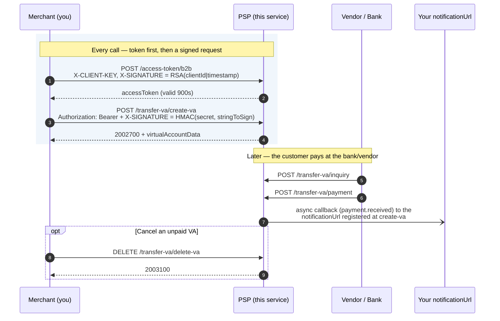

# Merchant Onboarding Guide

This guide is for **merchants** that manage virtual accounts via
`create-va`, `list`, and `delete-va` — creating, listing, and cancelling VAs
on this PSP.

If you are a **vendor/bank** notifying this PSP about inquiries or payments
against a VA (not managing VAs directly), see
[vendor-onboarding.md](./vendor-onboarding.md) instead — the two roles use
completely different, independent credentials.

## Flow at a glance



The two signatures use **different algorithms and different keys**: the token
request is RSA-signed with your private key, the API request is HMAC-signed
with your shared secret. Both are needed — see
[How authentication works](#how-authentication-works).

## What you need to provide us

An **RSA public key** (2048-bit or stronger), generated from a keypair you
control. You keep the private key; you send us only the public key.

```bash
openssl genpkey -algorithm RSA -out your-private-key.pem -pkeyopt rsa_keygen_bits:2048
openssl rsa -in your-private-key.pem -pubout -out your-public-key.pem
# Send your-public-key.pem to us. Keep your-private-key.pem secret — never
# transmit it anywhere, including to us.
```

## What we need to give you

1. A **`clientId`** (a UUID or similar identifier we assign, or one you
   propose — coordinate with operations).
2. A **shared secret** for HMAC signing, generated and provisioned on our
   side. **This value must be shared with you over a secure, out-of-band
   channel** (encrypted messaging, a secrets vault, etc.) — never over plain
   email or chat.

Both are provisioned together by our operations team running:

```bash
./scripts/onboard-merchant.sh -n <your-merchant-name> -K <admin-api-key>
```

(Or, if you already generated your own keypair per the previous section,
operations can register it directly via the admin API — see
[Manual registration](#manual-registration-without-onboard-merchantsh) below.)

## How authentication works

Every request to `create-va`, `list`, or `delete-va` must pass **two
independent checks**, both required simultaneously:

1. **A valid, unexpired `accessToken`**, sent as `Authorization: Bearer
   <accessToken>` — obtained from `POST /openapi/v1.0/access-token/b2b`,
   asymmetrically signed with your RSA private key (proves who you are).
2. **A valid `X-SIGNATURE`**, computed with your shared secret (proves the
   request body hasn't been tampered with, and that you actually hold the
   secret — not just an intercepted/replayed token).

Passing only one is not sufficient — a leaked `accessToken` alone cannot be
used to act as you without also knowing your shared secret, and vice versa.

### Step 1: Obtain an accessToken

```
POST /openapi/v1.0/access-token/b2b
X-CLIENT-KEY: <your clientId>
X-TIMESTAMP: <ISO 8601 timestamp>
X-SIGNATURE: <base64 RSA-SHA256 signature>
Content-Type: application/json

{"grantType":"client_credentials","additionalInfo":{}}
```

Where `X-SIGNATURE = base64(RSA-SHA256-sign(yourPrivateKey, "{clientId}|{timestamp}"))`.

The response includes `accessToken`, valid for **15 minutes (900 seconds)**
— you must refresh it periodically; don't cache it longer than that.

See [`scripts/curl-b2b-token.sh`](../../scripts/curl-b2b-token.sh) for a
complete reference implementation.

### Step 2: Sign your create-va/list/delete-va request

For every request to `create-va`, `list`, or `delete-va`:

1. **Build the request body** as a JSON object per the request's schema.
2. **Compute the timestamp**: current time in ISO 8601.
3. **Hash the body**: `bodyHash = base64(SHA256(body))`.
4. **Build `stringToSign`**:
   ```
   stringToSign = "{METHOD}:{PATH}:{accessToken}:{bodyHash}:{timestamp}"
   ```
   `{METHOD}` is the real HTTP method — `POST` for `create-va` and `list`,
   but **`DELETE`** for `delete-va`. `{PATH}` is the exact path of the URL you
   actually request, including any prefix; we verify against the path as
   received, so a gateway that rewrites the path means you sign the rewritten
   one. Getting either wrong surfaces as `[Invalid signature]`, which is easy
   to misdiagnose as a wrong secret.
   **Important**: the `accessToken` slot here is always the **real token
   from Step 1** (not empty) — because you genuinely send it via the
   `Authorization` header on this endpoint, both sides of the signature
   computation need to agree on that same value. (The vendor side has an
   equivalent real-token convention too, but only for vendors who've
   migrated to it — see
   [vendor-onboarding.md](./vendor-onboarding.md#how-authentication-works);
   legacy vendors still use an empty slot.)
5. **Sign**: `signature = base64(HMAC-SHA512(yourSharedSecret, stringToSign))`.
6. **Send these headers**:

   | Header | Value |
   |---|---|
   | `Content-Type` | `application/json` |
   | `Authorization` | `Bearer <accessToken>` from Step 1 |
   | `X-TIMESTAMP` | The same timestamp used in step 2 |
   | `X-SIGNATURE` | The base64 signature from step 5 |
   | `X-EXTERNAL-ID` | Numeric string, unique per calendar day (idempotency key) |

   Unlike the vendor endpoints, `CHANNEL-ID` and `X-PARTNER-ID` are **not**
   enforced on `create-va`/`list`/`delete-va` — you may send them for SNAP
   consistency, but they are neither required nor part of `stringToSign`.
   The vendor endpoints do require them; see
   [vendor-onboarding.md](./vendor-onboarding.md#request-signing-steps) if you
   also operate on that side.

### Timestamp freshness

`X-TIMESTAMP` must be within **±5 minutes** of our server's clock — same
tolerance as the vendor side. Requests outside that window are rejected with
`401 Unauthorized`.

### What gets rejected

| Condition | Response |
|---|---|
| No `Authorization` header at all | `401 Unauthorized. [Missing or invalid Authorization header]` |
| Token invalid, malformed, or expired | `401 Unauthorized. [Invalid or expired access token]` |
| Your `clientId` has no shared secret provisioned | `401 Unauthorized. [No signing secret provisioned for this client]` |
| `X-TIMESTAMP` outside ±5 minute window | `401 Unauthorized. [Timestamp skew exceeds 5 minutes]` |
| `X-SIGNATURE` missing or doesn't match | `401 Unauthorized. [Invalid signature]` |

There is **no opt-out** — both checks are unconditional from deployment.
Make sure you're provisioned (Step 0 above) **before** attempting any
create-va/list/delete-va call, or every request will fail closed regardless
of how correctly it's signed.

Idempotency is keyed on `X-EXTERNAL-ID` alone (not scoped per endpoint):
replaying the same value with the **same** body returns the original
response with an `X-Cache-Replay: true` header; with a **different** body you
get `422 Unprocessable Entity` (`4227300`), and while the first request is
still in flight you get `409 Conflict` (`4097300`).

## Response codes

We follow the ASPI `AAABBCC` format — `AAA` = HTTP status, `BB` = service
code, `CC` = case code. The service code differs **per endpoint**:

| Endpoint | Method | Success | Common failures |
|---|---|---|---|
| `/access-token/b2b` | POST | `2007300` | `4017300` unknown client or bad RSA signature |
| `/transfer-va/create-va` (27) | POST | `2002700` | `4002700` field format · `4002701` missing mandatory · `5002700` |
| `/transfer-va/delete-va` (31) | DELETE | `2003100` | `4003101` field format / missing mandatory · `5003100` |
| `/transfer-va/list` | POST | `2002400` | not an ASPI-defined endpoint — a dashboard convenience API |
| `/transfer-va/list-transactions` | POST | `2002400` | not an ASPI-defined endpoint — a dashboard convenience API |

Auth failures on any of these are `401` with `4010000`, per the table above.

## Payload notes

Request and response bodies follow the ASPI
[Virtual Account](https://apidevportal.aspi-indonesia.or.id/api-services/transfer-kredit/virtual-account)
schemas (`additionalInfo` aside, which is an open extension slot). Two things
worth calling out:

- **`partnerServiceId` is 8 characters, left-padded with spaces**, and
  `virtualAccountNo` is `partnerServiceId` + `customerNo` — so
  `"   12345"` + `"0001234567"` gives `"   123450001234567"`. Sending an
  unpadded `partnerServiceId` is the single most common create-va mistake.
- **`additionalInfo.dbUrlProcess`** is where you register the callback URL
  for this VA. When the vendor later reports a payment, we POST a
  `payment.received` notification there asynchronously. Without it, the VA
  works but you get no callback.
- **`additionalInfo.subCompany`** (optional, max 5 chars) is your registered
  biller sub-company code. We store it on the transaction and echo it as
  `virtualAccountData.subCompany` on every vendor inquiry for this VA. ASPI
  has no top-level `subCompany` on the create-va request — it exists only on
  the inquiry/payment messages — hence the `additionalInfo` slot. If you omit
  it, we fall back to the `billSubCompany` on your `billDetails`, and if that
  is empty too the field is simply absent from the inquiry response.

The create-va response echoes your submitted fields back inside
`virtualAccountData`. It does **not** include `lastUpdateDate` — per the ASPI
portal that field belongs to the `update-va` / `update-status` /
`inquiry-va` responses, not to `create-va`.

### No-bill VAs: call create-va once

For **no-bill** VA types (`additionalInfo.vaType` `01` static or `04` dynamic)
`create-va` registers the VA number and nothing else — no bill, no
`totalAmount`, no transaction. The number then behaves like an e-wallet top-up
address: your customer can pay into it whenever they like, for whatever amount
they like, as many times as they like, and each payment becomes its own
transaction with its own callback.

**You only need to call `create-va` once per VA number.** Calling it again for
the same number updates the holder details (name, email, phone, callback URL)
and returns `2002700` — it is not a conflict, and it does not create anything.
Sending `totalAmount` on a no-bill request is rejected with `4002706`, because
a no-bill VA has no bill.

To stop a no-bill VA accepting payments, call `delete-va`: it deactivates the
registration. Payments already received stay readable via
`/transfer-va/list-transactions`. Re-running `create-va` for that number
reactivates it.

Bill-bearing types (`02`, `03`, `05`, `06`) are unchanged: `create-va` creates
a pending transaction bound to `totalAmount`, and you call it once per bill.

### Listing: VAs vs payments

Because one no-bill VA can hold many payments, the two listings answer
different questions:

- `POST /transfer-va/list` — one entry per registered VA number, with
  `transactionCount` and `totalPaid` for that VA. Its `status` filter takes
  registration states: `ACTIVE`, `INACTIVE`, `EXPIRED`.
- `POST /transfer-va/list-transactions` — one entry per payment, filterable by
  `virtualAccountNo`. Its `status` filter takes transaction states: `00` paid,
  `02` expired, `03` pending, `04` deleted.

## Receiving callbacks

When a vendor reports a payment against one of your VAs, we `POST` a
notification to the `additionalInfo.dbUrlProcess` URL you registered at
create-va time. Delivery is asynchronous (queued, then sent by a background
worker) and typically lands within a second of the vendor's `/payment` call.

This callback is **our own extension, not an ASPI-defined message** — the
SNAP VA spec has no PJP→merchant notification. The shape is:

```json
{
  "eventType": "payment.received",
  "timestamp": "2026-08-03T03:06:39Z",
  "data": {
    "virtualAccountNo": "   1234510063781",
    "customerNo": "10063781",
    "trxId": "TRX-178572639726193",
    "paymentRequestId": "INQ-178572639822823",
    "paidAmount": { "value": "150000.00", "currency": "IDR" },
    "trxDateTime": "2026-08-03T10:06:38+07:00",
    "referenceNo": "R785726398",
    "status": "00"
  }
}
```

A second event type, `va.expired`, is sent when a VA passes its
`expiredDate` unpaid. Its `data` carries `virtualAccountNo`, `customerNo`,
`trxId`, `expiredAt`, and `status: "02"`.

**Verify the signature.** Each callback carries:

| Header | Value |
|---|---|
| `X-Signature` | `base64(HMAC-SHA512(notificationSecret, rawRequestBody))` |
| `X-Timestamp` | Send time, ISO 8601 |

Two differences from the request-signing scheme above, both easy to trip on:

- The HMAC is computed over the **raw body bytes only**, not over a
  `stringToSign`. Compare against the exact bytes you received, before
  parsing the JSON.
- The key is a **separate, service-wide notification secret**
  (`NOTIFICATION_SECRET`), *not* the shared secret you use to sign create-va
  requests. Ask operations for its value.

Your endpoint should respond `2xx` promptly. Return non-`2xx` and the
delivery is recorded as failed; ask operations to replay it via
`POST /admin/transactions/{virtualAccountNo}/resend-callback`.

Two things to plan for:

- **The URL must be reachable from our servers.** A `localhost` or private
  address won't work from a deployed environment — a common surprise when
  moving from local testing to UAT.
- **Handle duplicates idempotently**, keyed on `paymentRequestId`.

## Reference implementation

See [`scripts/merchant-create-va.sh`](../../scripts/merchant-create-va.sh),
[`scripts/merchant-list-va.sh`](../../scripts/merchant-list-va.sh), and
[`scripts/merchant-delete-va.sh`](../../scripts/merchant-delete-va.sh) for a
complete, runnable bash implementation — including automatic accessToken
refresh when using their `-f <.env.merchant.NAME>` flag.

## Local testing quickstart

```bash
# 1. Onboard yourself as a test merchant against a local instance:
./scripts/onboard-merchant.sh -n mytest -K changeme -u http://localhost:8080
# Writes .env.merchant.mytest with your clientId, private key path, and secret.

# 2. Create a VA — token fetch + signing happen automatically:
./scripts/merchant-create-va.sh -s 088899 -n "Test VA" -c 0001234567 \
  -a 50000.00 -f .env.merchant.mytest -u http://localhost:8080

# 3. List your VAs:
./scripts/merchant-list-va.sh -s 088899 -f .env.merchant.mytest -u http://localhost:8080
```

## Manual registration (without onboard-merchant.sh)

If you already generated your own RSA keypair and want operations to
register it directly:

```bash
# 1. Register the client + public key:
curl -X POST https://<host>/admin/clients \
  -H "X-Admin-API-Key: <admin-api-key>" -H "Content-Type: application/json" \
  -d '{"clientId":"<your-client-id>","clientName":"<your-name>","keyId":"key-01","publicKeyPem":"<contents of your-public-key.pem>"}'

# 2. Provision a shared secret:
curl -X POST https://<host>/admin/clients/<your-client-id>/secret \
  -H "X-Admin-API-Key: <admin-api-key>" -H "Content-Type: application/json" \
  -d '{"secretId":"secret-01","secretValue":"<a strong random secret>"}'
```

The `secretValue` you choose in step 2 must then be shared with you securely
(or you generate it and send it to operations securely — either direction
works, as long as it never travels in plaintext over an insecure channel).

## Rotating your credentials

- **RSA key rotation**: generate a new keypair, ask operations to register
  it via `POST /admin/clients/{clientId}/keys` with a new `keyId` alongside
  your existing one, switch your signing to the new private key, then have
  operations revoke the old `keyId` via `DELETE
  /admin/clients/{clientId}/keys/{keyId}` once you've confirmed the new one
  works.
- **Shared secret rotation**: same pattern — `POST
  /admin/clients/{clientId}/secret` with a new `secretId`, switch your
  signing to the new secret, then `DELETE
  /admin/clients/{clientId}/secret/{secretId}` on the old one.

Both support a zero-downtime overlap window (old and new credential both
active simultaneously) since each is keyed by its own `keyId`/`secretId`,
unlike the vendor side's single-secret-per-file model.
