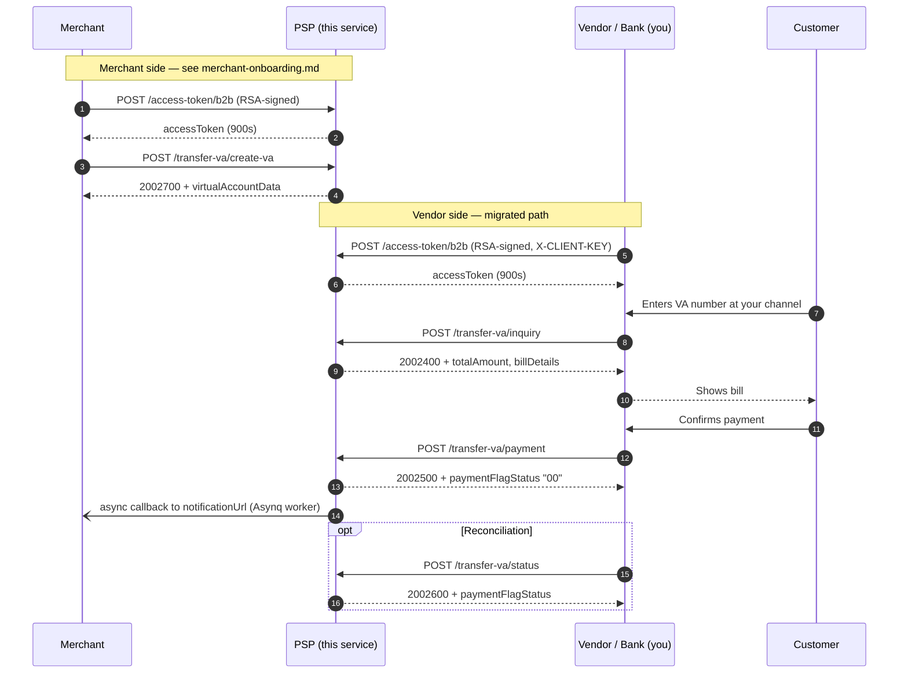

# Vendor Onboarding Guide

This guide is for **vendors/banks** that call this PSP's `transfer-va` endpoints
(`inquiry`, `payment`, `status`) as part of the SNAP virtual-account flow —
e.g. a switching vendor notifying this PSP that a customer inquired or paid a
virtual account.

If you are a **merchant** creating/managing virtual accounts (not a bank
calling in to notify about inquiries/payments), see
[merchant-onboarding.md](./merchant-onboarding.md) instead — the two roles
use completely different, independent credentials.

## Flow at a glance

The full lifecycle of one VA, showing where your calls (vendor) sit relative
to the merchant's. Steps 1–2 are the merchant's (see
[merchant-onboarding.md](./merchant-onboarding.md)); steps 3–8 are yours.



On the **legacy path**, drop the two `/access-token/b2b` messages on the
vendor side — everything else is identical.

## Two onboarding paths

- **Legacy (shared-secret only)**: the original, simplest path — a symmetric
  HMAC signature only, no bearer token. Still fully supported for vendors who
  haven't migrated.
- **Migrated (shared-secret + accessToken)**: newer vendors (or existing ones
  moving over) additionally send a bearer `accessToken`, bound into the
  signature (feature 011-vendor-access-token-signature). This is the
  recommended path for any new vendor integration — it binds proof-of-identity
  (the token) to proof-of-integrity (the signature) the same way the merchant
  side already works.

Which path applies to you is controlled entirely by whether your
`.env.<vendor>.<channel>` config has `VENDOR_CLIENT_ID` set — see
[What we need to give you](#what-we-need-to-give-you) below.

## What you need to provide us

- **Legacy path**: nothing. We generate your shared secret (or you propose
  one) — no keypair, no certificate, no registration request.
- **Migrated path**: additionally, an **RSA public key** (2048-bit or
  stronger), the same way merchants do (see
  [merchant-onboarding.md](./merchant-onboarding.md#what-you-need-to-provide-us)):

  ```bash
  openssl genpkey -algorithm RSA -out your-private-key.pem -pkeyopt rsa_keygen_bits:2048
  openssl rsa -in your-private-key.pem -pubout -out your-public-key.pem
  # Send your-public-key.pem to us. Keep your-private-key.pem secret — never
  # transmit it anywhere, including to us.
  ```

## What we need to give you

1. A **shared secret** (a random string, e.g. 32 bytes hex-encoded) —
   required on both paths. This is the only credential needed to sign your
   requests to us. It will be provisioned into our system via:

   ```bash
   ./scripts/onboard-vendor.sh -n <your-vendor-name> -c <channel> -o <output-dir>
   ```

   This writes a `.env.<vendor>.<channel>` file (e.g. `.env.bca.va`) containing
   your `VENDOR_CLIENT_ID` and `VENDOR_CLIENT_SECRET`, which our operations
   team deploys into the running service's `CONFIG_DIR`. **The secret value
   itself must be shared with you over a secure, out-of-band channel**
   (encrypted messaging, a secrets vault, etc.) — never over plain email or
   chat.

2. **Migrated path only**: your `VENDOR_CLIENT_ID` must also be registered as
   a `client_apps` row with your public key attached, so you can obtain an
   `accessToken`:

   ```bash
   # Register the client + public key (uses the same VENDOR_CLIENT_ID already
   # in your .env.<vendor>.<channel> file):
   curl -X POST https://<host>/admin/clients \
     -H "X-Admin-API-Key: <admin-api-key>" -H "Content-Type: application/json" \
     -d '{"clientId":"<your VENDOR_CLIENT_ID>","clientName":"<your-name>","keyId":"key-01","publicKeyPem":"<contents of your-public-key.pem>"}'
   ```

   Leaving `VENDOR_CLIENT_ID` unset in your config keeps you on the legacy
   path indefinitely — there's no forced cutover date.

## How authentication works

### Legacy path (no `VENDOR_CLIENT_ID` configured)

Every request you send to `inquiry`, `payment`, or `status` is verified with
a **symmetric HMAC-SHA512 signature only** — there is no bearer token, no
RSA keypair, and no `X-CLIENT-KEY` header involved on these endpoints. This
is deliberately simpler than a full OAuth-style flow: since these are
trusted, pre-provisioned server-to-server calls (not calls with a public
attack surface where you'd want short-lived tokens), a shared secret known
only to you and us is sufficient.

### Migrated path (`VENDOR_CLIENT_ID` configured)

You additionally obtain and send a bearer `accessToken`, which is bound into
the signature — the same two-factor model merchants use (see
[merchant-onboarding.md](./merchant-onboarding.md#how-authentication-works)).
A leaked `accessToken` alone cannot be used to act as you without also
knowing your shared secret, and vice versa.

**Step 1: Obtain an accessToken** — identical to the merchant flow:

```
POST /openapi/v1.0/access-token/b2b
X-CLIENT-KEY: <your VENDOR_CLIENT_ID>
X-TIMESTAMP: <ISO 8601 timestamp>
X-SIGNATURE: <base64 RSA-SHA256 signature>
Content-Type: application/json

{"grantType":"client_credentials","additionalInfo":{}}
```

Where `X-SIGNATURE = base64(RSA-SHA256-sign(yourPrivateKey, "{clientId}|{timestamp}"))`.
The response includes `accessToken`, valid for **15 minutes (900 seconds)** —
refresh it periodically. See
[`scripts/curl-b2b-token.sh`](../../scripts/curl-b2b-token.sh) for a complete
reference implementation.

### Request signing steps

For every request to `inquiry`, `payment`, or `status`:

1. **Build the request body** as a JSON object per the SNAP transfer-va spec.
2. **Compute the timestamp**: current time in ISO 8601, e.g.
   `2026-07-30T10:15:00+07:00`.
3. **Hash the body**: `bodyHash = hex(SHA256(minify(body)))`.

   **Minify first.** SNAP specifies
   `Lowercase(HexEncode(SHA-256(MinifyJson(RequestBody))))` — `minify` is the
   JSON with all insignificant whitespace removed. If you send a compact body
   this changes nothing; if you pretty-print, hashing the raw bytes gives a
   different digest than we compute and every request comes back
   `[Invalid signature]`. In `jq` terms: `jq -cj .` — the `-j` matters,
   because `jq -c` alone appends a newline that would be hashed too.

   **Encoding is lowercase hex**, per the SNAP spec. Vendors onboarded under
   feature `012-base64-hash-encoding` sign with base64 instead; that is a
   per-vendor setting (`VENDOR_BODY_HASH_ENCODING`) so one vendor's
   non-conformant encoding cannot push every other vendor off spec. Ask
   operations which one is provisioned for your channel if you are unsure —
   the merchant endpoints use base64 for the same historical reason.
4. **Build `stringToSign`**:
   ```
   stringToSign = "{METHOD}:{PATH}:{accessToken}:{bodyHash}:{timestamp}"
   ```
   `{PATH}` must be the **exact path of the URL you actually request**,
   including any prefix. We verify against the path as received, so if you
   call `https://host/openapi/v1.0/transfer-va/inquiry` you sign
   `/openapi/v1.0/transfer-va/inquiry` — and if a gateway in front of us
   rewrites the path, sign the rewritten one. A mismatch here surfaces as
   `[Invalid signature]`, which is easy to misdiagnose as a wrong secret.
   - **Legacy path**: the `{accessToken}` slot is always the **empty
     string** — no header on these endpoints carries one, so both colons
     sit next to each other:
     ```
     stringToSign = "{METHOD}:{PATH}::{bodyHash}:{timestamp}"
     ```
     Example for `POST /openapi/v1.0/transfer-va/inquiry`:
     ```
     POST:/openapi/v1.0/transfer-va/inquiry::ede1b7f180fdcb80bc6d71a3...:2026-07-30T10:15:00+07:00
     ```
   - **Migrated path**: the `{accessToken}` slot is the **real token from
     Step 1** (not empty) — you genuinely send it via `Authorization`, so
     both sides of the signature computation must agree on that same value.
     Example:
     ```
     POST:/openapi/v1.0/transfer-va/inquiry:eyJhbGciOi...:ede1b7f180fdcb80bc6d71a3...:2026-07-30T10:15:00+07:00
     ```
5. **Sign**: `signature = base64(HMAC-SHA512(yourSharedSecret, stringToSign))`.
6. **Send these headers**:

   | Header | Value | Required on |
   |---|---|---|
   | `Content-Type` | `application/json` | Both |
   | `Authorization` | `Bearer <accessToken>` from Step 1 | Migrated path only |
   | `X-TIMESTAMP` | The same timestamp used in step 2 | Both |
   | `X-SIGNATURE` | The base64 signature from step 5 | Both |
   | `X-PARTNER-ID` | Your assigned partner ID (max 36 chars) | Both |
   | `X-EXTERNAL-ID` | Numeric string, unique per calendar day (idempotency key) | Both |
   | `CHANNEL-ID` | Your assigned channel ID (5 chars) | Both |
   | `X-CLIENT-KEY` | Your `VENDOR_CLIENT_ID` | Only if your config demands it — see below |

   Per the ASPI *Standar Teknis dan Keamanan*, `CHANNEL-ID` is **Mandatory**
   on transaction requests (not optional), and `X-EXTERNAL-ID` must be a
   numeric string unique within the same calendar day.

#### How this compares to the merchant side

Both sides use the same `stringToSign` shape and the same minify-then-hash
rule for the body. Only three things differ, and none of them is a difference
in *algorithm*:

| | Vendor (`inquiry`/`payment`/`status`) | Merchant (`create-va`/`list`/`delete-va`) |
|---|---|---|
| Body digest | `SHA-256(minify(body))` | `SHA-256(minify(body))` — same rule |
| Digest encoding | lowercase **hex** (or base64 per `VENDOR_BODY_HASH_ENCODING`) | **base64** |
| `{accessToken}` slot | empty on the legacy path, the real token once migrated | always the real token |
| `CHANNEL-ID` / `X-PARTNER-ID` | required | not enforced |

The body rule was **not** always the same: the merchant endpoints used to hash
the raw, un-minified body. If you operate on both sides and wrote your
merchant signing against that older behaviour, see
[merchant-onboarding.md](./merchant-onboarding.md#step-2-sign-your-create-valistdelete-va-request)
— there is a transitional fallback, but it will be turned off.

#### About `X-CLIENT-KEY`

Per the ASPI spec, `X-CLIENT-KEY` belongs to `/access-token/b2b` **only** and
has no meaning on `inquiry`/`payment`/`status`. However, the header set we
enforce on those endpoints is driven by `VENDOR_REQUIRED_HEADERS` in your
`.env.<vendor>.<channel>` config, and a deployment is free to list
`X-CLIENT-KEY` there. When it is listed, omitting the header fails the
request before any signature check:

```json
{"responseCode":"4010000","responseMessage":"Unauthorized. [Missing required header: X-CLIENT-KEY]"}
```

Ask operations for the exact `VENDOR_REQUIRED_HEADERS` value provisioned for
your channel. If in doubt, **sending `X-CLIENT-KEY` is always safe**: it is
never part of `stringToSign`, so it is simply ignored where it isn't
required. Our reference scripts send it automatically, defaulting to
`VENDOR_CLIENT_ID` (override with `-k`).

### Timestamp freshness

`X-TIMESTAMP` must be within **±5 minutes** of our server's clock. Requests
outside that window are rejected with `401 Unauthorized` regardless of
whether the signature is otherwise correct — make sure your system clock is
NTP-synchronized.

### What gets rejected

| Condition | Response | Applies to |
|---|---|---|
| `X-SIGNATURE` missing or doesn't match | `401 Unauthorized. [Invalid signature]` | Both |
| `X-TIMESTAMP` outside ±5 minute window | `401 Unauthorized. [Timestamp skew exceeds 5 minutes]` | Both |
| A required header is missing entirely | `401 Unauthorized. [Missing required header: ...]` | Both |
| No `Authorization` header at all | `401 Unauthorized. [Missing or invalid Authorization header]` | Migrated path only |
| Token invalid, malformed, or expired | `401 Unauthorized. [Invalid or expired access token]` | Migrated path only |
| Token was issued for a different `clientId` than yours, or was swapped after signing | `401 Unauthorized. [Invalid signature]` (same generic message — not distinguished from a plain signature mismatch) | Migrated path only |
| `X-EXTERNAL-ID` reused with a *different* body | `422 Unprocessable Entity. X-EXTERNAL-ID payload mismatch.` (`4227300`) | Both |
| `X-EXTERNAL-ID` reused while the first request is still in flight | `409 Conflict. Request currently in progress for this X-EXTERNAL-ID.` (`4097300`) | Both |

Reusing an `X-EXTERNAL-ID` with the *same* body is safe — you get the
original response back, tagged with an `X-Cache-Replay: true` header. Note
the idempotency key is the `X-EXTERNAL-ID` value alone, not scoped per
endpoint, so the same value must not be reused across different endpoints
either.

## Request payloads

Field names and obligations below come from the ASPI portal's
[Virtual Account](https://apidevportal.aspi-indonesia.or.id/api-services/transfer-kredit/virtual-account)
tables. `additionalInfo` is an open extension slot and is not covered here.

### `POST /transfer-va/inquiry` (service code 24)

| Field | Obligation | Notes |
|---|---|---|
| `partnerServiceId` | M | 8 chars, **left-padded with spaces** |
| `customerNo` | M | up to 20 digits |
| `virtualAccountNo` | M | `partnerServiceId` + `customerNo`, 28 chars |
| `inquiryRequestId` | M | unique per inquiry, up to 128 chars |
| `trxDateInit` | O | ISO-8601 with timezone, 25 chars |
| `amount` | O | `{value, currency}`; `value` has 2 decimals |
| `channelCode`, `language`, `hashedSourceAccountNo`, `sourceBankCode`, `passApp` | O | |

> The ASPI page spells this field `trxDateInit` in its field table but
> `txnDateInit` in its sample request. We accept **`txnDateInit`**, matching
> `aspi-open-api-va.yaml`. It is optional either way.

### `POST /transfer-va/payment` (service code 25)

| Field | Obligation | Notes |
|---|---|---|
| `partnerServiceId`, `customerNo`, `virtualAccountNo` | M | as above |
| `paymentRequestId` | M | **If the payment follows an inquiry, this must equal that inquiry's `inquiryRequestId`.** |
| `trxId` | C | **Mandatory if the payment follows a create-VA request** — send the `trxId` we returned from `create-va`, not one you generate |
| `paidAmount` | M | `{value, currency}` |
| `totalAmount` | O | when present, must equal `paidAmount` or you get `4002501 Invalid Field Format [amount mismatch]` |
| `trxDateTime` | O | ISO-8601 with timezone |
| `referenceNo`, `journalNum`, `paymentType`, `flagAdvise`, `paidBills`, `subCompany`, `billDetails`, `freeTexts` | O | |

**Do not send `inquiryRequestId`** — it is not a field of the ASPI
PaymentRequest. It appears only inside the *description* of
`paymentRequestId`, as the rule quoted above. We still accept it for
backward compatibility with legacy vendors, but new integrations should omit
it.

There is also no `transactionDate` on this endpoint — only `trxDateTime`.

### `POST /transfer-va/status` (service code 26)

| Field | Obligation |
|---|---|
| `partnerServiceId`, `customerNo`, `virtualAccountNo` | M |
| `inquiryRequestId` | M |
| `paymentRequestId` | M |

## Response codes

We follow the ASPI `AAABBCC` format — `AAA` = HTTP status, `BB` = service
code, `CC` = case code. Note the service code differs **per endpoint**, so
`/payment` never returns a `…24…` code:

| Endpoint | Success | Common failures |
|---|---|---|
| `/access-token/b2b` | `2007300` | `4017300` unknown client / bad signature |
| `/inquiry` (24) | `2002400` | `4002401` field format · `4002402` missing mandatory · `4042419` expired bill · `4042414` bill already paid · `4042412` invalid/deleted VA · `5002400` |
| `/payment` (25) | `2002500` | `4002501` field format / amount mismatch · `4002502` missing mandatory · `4042519` VA expired · `4092500` already paid or inactive · `5002500` |
| `/status` (26) | `2002600` | `4042619` invalid bill/VA · `5002600` |

`paymentFlagStatus` in a `/payment` or `/status` success body is `"00"` for
settled and `"03"` for pending (a partial payment on a variable-bill VA).

`inquiryStatus` in an `/inquiry` body reflects the VA's stored state: `"00"`
on the `2002400` success body, `"01"` on every `404…` body above, alongside an
`inquiryReason` saying which of the three it was. `subCompany` and
`totalAmount` are likewise read back from the stored transaction (or its bill
details), so an inquiry replay always reports the same figures as the first
inquiry did; `subCompany` is omitted entirely when the biller has none
registered.

There is **no opt-out or grace period** once you're on a given path —
enforcement is unconditional from the moment your `.env.<vendor>.<channel>`
file is deployed with `VENDOR_CLIENT_SECRET` set (and, if migrated,
`VENDOR_CLIENT_ID` set). Test your signing implementation in staging before
going live.

## Reference implementation

See [`scripts/vendor-inquiry-va.sh`](../../scripts/vendor-inquiry-va.sh) and
[`scripts/vendor-payment-va.sh`](../../scripts/vendor-payment-va.sh) for a
complete, runnable bash implementation of the signing steps above — useful
both as a reference and for testing against a local instance. When your
`.env.<vendor>.<channel>` file has `VENDOR_CLIENT_ID` and
`VENDOR_PRIVATE_KEY_PATH` set, these scripts auto-fetch an `accessToken` via
[`scripts/curl-b2b-token.sh`](../../scripts/curl-b2b-token.sh) and bind it in
automatically — no need to pass one yourself. Omit both to exercise the
legacy path unchanged.

Flags worth knowing on `vendor-payment-va.sh`:

| Flag | Purpose |
|---|---|
| `-t <trxId>` | the create-va `trxId`, sent as `PaymentRequest.trxId`. Omitted from the body entirely when not given |
| `-q <paymentRequestId>` | use the inquiry's `inquiryRequestId` here when the payment follows an inquiry |
| `-k <client-key>` | override the `X-CLIENT-KEY` value (defaults to `VENDOR_CLIENT_ID`) |

[`scripts/e2e-va-flow.sh`](../../scripts/e2e-va-flow.sh) chains create-va →
inquiry → payment → callback and wires `-t`/`-q` from the previous steps'
responses automatically, so it exercises the spec-correct linkage end to end.

## Rotating your shared secret

Contact operations to have a new secret generated and deployed. Since the
current implementation stores a single `VENDOR_CLIENT_SECRET` per
`.env.<vendor>.<channel>` file (not a rotate-with-overlap scheme like the
merchant side's `client_secrets` table), a secret rotation is a coordinated
cutover: agree on a switchover time, update the file, and restart the
service — there is no dual-active-secret window today.

## Rotating your RSA key (migrated path only)

Same overlap-capable pattern as the merchant side: generate a new keypair,
ask operations to register it via `POST /admin/clients/{clientId}/keys` with
a new `keyId` alongside your existing one, switch your token-request signing
to the new private key, then have operations revoke the old `keyId` via
`DELETE /admin/clients/{clientId}/keys/{keyId}` once you've confirmed the new
one works.
